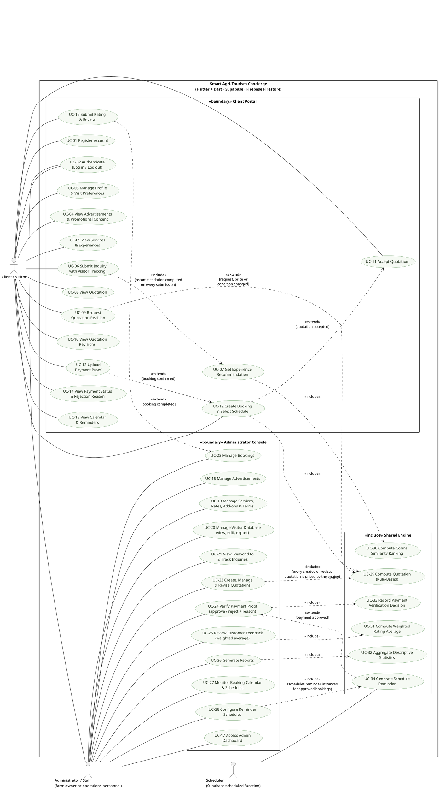
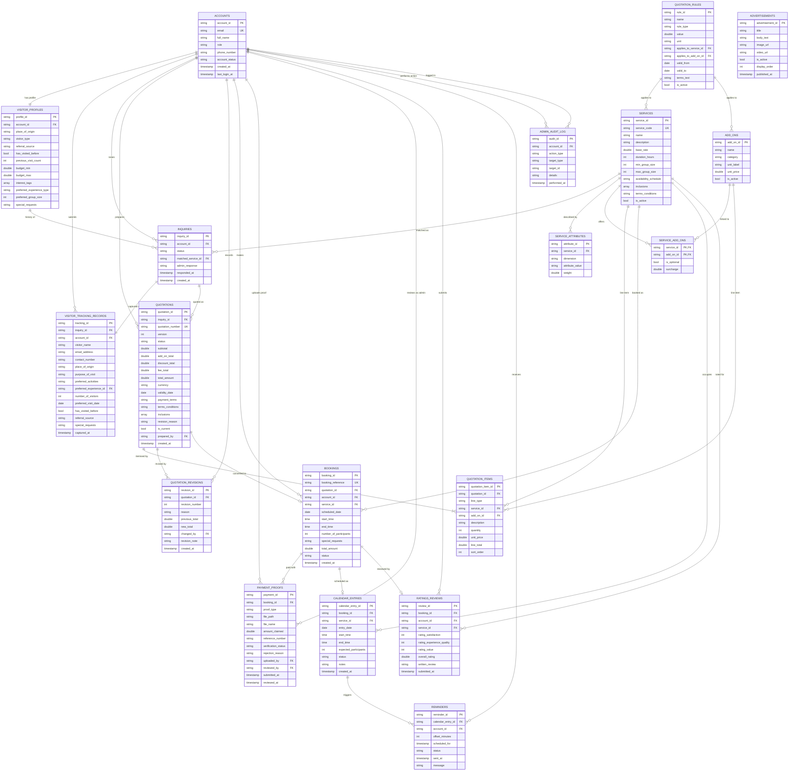

# Smart Agri-Tourism Concierge — Gran Verde Cacao Farm
## Requirements Analysis, Use Case Diagram, ERD, Data Dictionary & Design Validation

**Source of truth:** `ACM-Gran-Verde-Revised-Flutter.docx` (Barrios & Bajo, University of Mindanao)
**CCS Concepts:** Information Systems → Information Systems Applications → Recommender System
**General Terms:** Management; Documentation; Design; Performance

---

# STEP 1 — REQUIREMENTS ANALYSIS

## 1.1 Project Context and Problem Statement

Gran Verde Cacao Regenerative Farm (Davao Region) receives visitor inquiries through **separate
channels** (website, social media, e-mail) and prepares quotations and bookings **manually**.
The identified problems, taken verbatim from the study's stated baseline:

| ID | Problem (as documented) | Consequence |
|----|-------------------------|-------------|
| P1 | Inquiries arriving through separate channels are not consolidated | No complete view of a visitor's preferences (CRM gap) |
| P2 | Quotations are prepared manually from current rates, inclusions, terms and add-ons | Long turnaround, inconsistent figures |
| P3 | Booking handling depends on manual checking | Exposed to scheduling errors (cf. ref. [15] web-based resort reservation system reduced booking errors) |
| P4 | Matching visitors to the three offerings (Kakaw Lakaw, Bahandi sa Uma, Customized Options) has no structured method | Cold-start / no preference-based matching; content-based filtering recommended [16]–[21] |
| P5 | Without consolidated data, reporting on inquiries, bookings and visitors is limited; visitor feedback has no consolidated place | No descriptive analytics; no ratings/reviews |

**Target system:** a **Flutter + Dart** application (clients and administrators) → **Supabase**
backend (authentication, role-based access control, payment-proof file storage, scheduled
server-side reminder functions) → **Firebase Firestore** (all business records) → deployed on
**Firebase Hosting** (web build).

## 1.2 Existing Manual Process (AS-IS) — baseline only, NOT implemented

```
Advertisement / Promotional Materials
        ↓
Visitor Inquiry  (website / social media / e-mail — separate channels)
        ↓
Manual Quotation Preparation (rates, inclusions, terms, add-ons)
        ↓
Quotation Adjustment / Revision  (requested services, prices, conditions)
        ↓
Customer Agreement
        ↓
Booking  →  Payment  →  Schedule recorded & monitored in a manual calendar
```
> Per §1.4 Scope, this is the baseline to be improved and is **not** part of the application.

## 1.3 Proposed System Process (TO-BE) — the implemented workflow

```
[1] Advertisement & Promotional Content
        ↓
[2] Inquiry + Visitor Tracking  (submitted through the client account)
        ↓  ← Experience Matching (content-based filtering, cosine similarity) runs here
[3] Dynamic Quotation  (rule-based: rates, inclusions, terms, conditions, optional add-ons)
        ↓  ← [3a] Quotation Revision  (client request / price change / condition change)
[4] Client Accepts Quotation
        ↓
[5] Booking  (client selects the preferred schedule, confirms details)
        ↓
[6] Payment Proof Upload  (GCash receipt or bank transaction proof → Supabase Storage)
        ↓
[7] Administrator Payment Verification  → APPROVE  |  REJECT (with reason)
        ↓
[8] Calendar Entry + Schedule Reminders  (client and authorized administrator)
        ↓
[9] Rating & Review  (1–5 stars, weighted statistical method) → administrator feedback analysis
        ↘
[10] Descriptive Reports (visitor tracking, inquiries, bookings, most frequently selected services)
```

**Scope boundary honoured:** the application **never processes payments**; it only receives and
verifies proof. Inquiries from off-platform channels (social media, e-mail) are **not** imported.
No physical farm operations, no inventory, no predictive analytics.

## 1.4 Actors / Users

| Actor | Description (from §1.2) | Account provisioning |
|-------|--------------------------|----------------------|
| **Client / Visitor** | Prospective and actual visitors of Gran Verde | Self-registered (name, contact information, email, password); login available **after admin inspection** |
| **Administrator / Staff** | The farm owner or designated operations personnel responsible for day-to-day visitor engagement | **Pre-provisioned — cannot self-register** |
| **Scheduler (system)** | Supabase scheduled server-side function that materialises reminders for approved bookings | Automated, not a human actor |

> **Design decision:** GCash and banks are **not** actors — §1.4 explicitly excludes payment-gateway
> integration. Modelling them would invent a feature the file forbids.

## 1.5 Objectives → Module Traceability

| Obj. | Statement (condensed) | Delivered by |
|------|------------------------|--------------|
| 1.3.2.1 | Smart inquiry system capturing inquiries, visitor profiles and visitor-tracking information in Firestore | Module M1 |
| 1.3.2.2 | Automated rule-based dynamic quotation from rates, inclusions, terms and add-ons; **< 15 min** preparation time | Module M2 |
| 1.3.2.3 | Experience matching for Kakaw Lakaw, Bahandi sa Uma, Customized Options from visitor preferences | Module M3 |
| 1.3.2.4 | Reports on visitor tracking and most frequently selected services (descriptive analysis) | Module M4 |
| 1.3.2.5 | Calendar + reminder module for approved booking schedules | Module M5 |
| 1.3.2.6 | Payment verification module: client uploads GCash/bank proof; admin approves or rejects **with reason** | Module M6 |
| 1.3.2.7 | Client ratings and reviews using weighted statistical methods | Module M7 |

## 1.6 Data to be Collected

**Visitor-sourced (§2.2.1 Input):** visitor profile (full name, email, contact number, account
credentials); inquiry & visitor-tracking data (date of inquiry, name of client, place of origin,
purpose of visit, preferred visit date, number of visitors, type of visitor or group, interests,
preferred experience, preferred activities, budget range, how the visitor learned about Gran Verde,
previous visits, special requests); booking data (selected experience, confirmed schedule, number of
participants, special requests, uploaded payment proof + verification status); feedback (1–5 star
ratings + written reviews).

**Management-sourced (§2.2.1 Input):** experience data (names, descriptions, inclusions, base
rates, duration, min/max group size, availability schedules); rate and add-on data (pricing tables,
optional add-ons such as meals/souvenirs/extended tours, discounts, terms and conditions);
quotation rules and templates (standard inclusions, validity periods, payment terms);
advertisement and reminder settings (promotional content incl. promotional videos, reminder
schedules for approved bookings).

**Outputs (§2.2.1 Output):** experience recommendations (ranked by cosine similarity); dynamic
quotations (base package costs, add-ons, discounts, total); revised quotations; booking
confirmations and payment status incl. rejection reason; schedule reminders; administrator reports
(inquiry, booking, visitor-tracking, service-selection, experience-performance) and analytics views.

## 1.7 Business Rules (BR) — derived strictly from the process description

| ID | Rule |
|----|------|
| BR-01 | Every inquiry submitted through the application is stored with a unique identifier, a timestamp, and a status of **New, In Progress, Quoted, Booked, or Closed**. |
| BR-02 | Every inquiry is recorded together with its visitor tracking information (1:1). |
| BR-03 | A quotation is generated from **current** rates, inclusions, terms, conditions and optional add-ons only. |
| BR-04 | A revision is required whenever the requested services, the price, or the conditions change; every revision increments the version and keeps the previous version. |
| BR-05 | A booking may only be created from an **accepted** quotation. |
| BR-06 | The client selects the preferred schedule; the system does not auto-assign schedules. |
| BR-07 | A payment proof (GCash receipt or bank transaction proof) must be uploaded after the booking is confirmed. |
| BR-08 | The application **does not process payments**; it stores proof and status only. |
| BR-09 | An administrator may approve or reject a payment proof; a rejection **must** carry a reason, and that reason is visible to the client. |
| BR-10 | A calendar entry exists only for an **approved** booking (booking + approved payment). |
| BR-11 | Reminders are generated only for approved bookings and are visible to the client and to authorized administrators. |
| BR-12 | A rating/review may be submitted only for a completed visit; the overall rating is a weighted average of satisfaction, experience quality and overall value. |
| BR-13 | Administrator accounts are pre-provisioned; self-registration cannot create an administrator. |
| BR-14 | Access to booking histories and uploaded payment proof is restricted to administrator accounts. |
| BR-15 | Experience matching ranks only the three Gran Verde offerings; recommendations are advisory, and the client may still choose any of them. |
| BR-16 | Reports are **descriptive only**; no predictive modelling. |
| BR-17 | Client accounts may read and write only their own records. |
| BR-18 | All administrative actions are access-logged. |

## 1.8 Non-Functional Requirements (targets the build is measured against)

| ID | Requirement | Verification |
|----|-------------|----------------|
| NFR-01 | Load in **≤ 3 s** on a standard connection | Timing harness in demo |
| NFR-02 | Inquiry + quotation generation in **< 15 min** (target 70% reduction) | Quotation generated in seconds by the rule engine |
| NFR-03 | Reports generated in **< 5 s** | Measured in demo admin reports |
| NFR-04 | Authentication for visitors and admins; passwords hashed; encryption in transit | Supabase Auth + RBAC; role checks in UI and rules |
| NFR-05 | Sensitive data (booking history, payment proof) admin-only | Firestore rules + role guards |
| NFR-06 | Mobile-first, accessible across devices, API-ready, cloud-based | Flutter + responsive web build |
| NFR-07 | ≥ 99% availability, scheduled backups, minor-outage recovery | Cloud-managed services; export/backup routine |
| NFR-08 | Data-exportable, privacy compliant | CSV export of visitor database; access logging |

---

# STEP 2 — UML USE CASE DIAGRAM

## 2.1 Diagram (PlantUML source — renders to UML)



## 2.2 Actors Explained

### C — Client / Visitor
A prospective or actual visitor. The study defines this account by what it *may do*: log in, view
advertisements and promotional materials, view services and experiences, submit inquiries and
visitor tracking information, select preferred experiences, receive and view quotations, request or
view revisions, proceed to booking, upload payment proof, view payment status and rejection reason,
view approved schedules, view calendar and reminders, and submit ratings and reviews. Their account is
self-created (FR 2.1.5.1.1) and usable only after administrator inspection.

### A — Administrator / Staff
The farm owner **or** designated operations personnel responsible for day-to-day visitor engagement.
Pre-provisioned, never self-registered (§1.2). Manages advertisements, services and experiences,
inquiries, visitor tracking records, quotations and revisions, prices/conditions/inclusions/add-ons,
bookings, payment verification, the booking calendar, reports, and ratings and reviews. Also
access-logs their own actions (BR-18).

### S — Scheduler (system)
The Supabase scheduled server-side function named in §2.2.1 Process ("Supabase … runs the scheduled
server-side functions that generate schedule reminders"). It is the only trigger of reminder
generation, and it acts only on approved bookings (BR-11).

## 2.3 Major Use Cases Explained

| UC | Name | Requirement source | Notes |
|----|------|--------------------|-------|
| UC-01 | Register Account | FR 2.1.5.1.1 | Name, contact information, email, password. Role fixed to *client* (BR-13). Login gated on admin inspection. |
| UC-02 | Authenticate | FR 2.1.5.1.1 / 2.1.5.2.1 | Shared by both actors — the *same* login use case, not two duplicates. Supabase Auth. |
| UC-03 | Manage Profile & Visit Preferences | FR 2.1.5.1.2 | Experience type, group size, interests, budget. These are the standing preferences consumed by the matching engine. |
| UC-04 | View Advertisements & Promotional Content | §1.2 client account, §1.4 | Includes promotional videos published by UC-18. |
| UC-05 | View Services & Experiences | §1.2, §1.4 | The three offerings with rates, inclusions, duration, min/max group size. |
| UC-06 | Submit Inquiry with Visitor Tracking | FR 2.1.5.1.3 | The 13 documented tracking fields captured with the inquiry. |
| UC-07 | Get Experience Recommendation | FR 2.1.5.1.4, Obj 1.3.2.3 | Ranked list of the three offerings by cosine similarity. |
| UC-08 | View Quotation | FR 2.1.5.1.5 | Itemised: base package, add-ons, discounts, total, validity, terms. |
| UC-09 | Request Quotation Revision | FR 2.1.5.1.5, BR-04 | Optional path. |
| UC-10 | View Quotation Revisions | FR 2.1.5.1.5 | Version history with reasons. |
| UC-11 | Accept Quotation | §1.3 step 4 | Gate for booking. |
| UC-12 | Create Booking & Select Schedule | FR 2.1.5.1.6 | Client selects the preferred schedule (BR-06). |
| UC-13 | Upload Payment Proof | FR 2.1.5.1.8 | GCash receipt or bank transaction proof; **proof only, no processing**. |
| UC-14 | View Payment Status & Rejection Reason | FR 2.1.5.1.8 | Status + the administrator's reason when rejected. |
| UC-15 | View Calendar & Reminders | FR 2.1.5.1.9 | Approved schedules only. |
| UC-16 | Submit Rating & Review | FR 2.1.5.1.7, Obj 1.3.2.7 | 1–5 stars on satisfaction, experience quality, overall value + written review. |
| UC-17 | Access Admin Dashboard | FR 2.1.5.2.1 | Role-gated entry. |
| UC-18 | Manage Advertisements | FR 2.1.5.2.10 | Add / update / remove incl. promotional videos. |
| UC-19 | Manage Services, Rates, Add-ons & Terms | §1.2, §2.2.1 Input | The data behind the quotation engine. |
| UC-20 | Manage Visitor Database | FR 2.1.5.2.2 | View, edit, export. |
| UC-21 | View, Respond to & Track Inquiries | FR 2.1.5.2.3 | Shows details, visitor profile, status. |
| UC-22 | Create, Manage & Revise Quotations | FR 2.1.5.2.4 | Status + revision tracking. |
| UC-23 | Manage Bookings | FR 2.1.5.2.5 | Booking info, schedule, visit date, payment status. |
| UC-24 | Verify Payment Proof | FR 2.1.5.2.6 | Approve or reject; reason mandatory on reject. |
| UC-25 | Review Customer Feedback | FR 2.1.5.2.7 | Weighted average computed by the system. |
| UC-26 | Generate Reports | FR 2.1.5.2.8, Obj 1.3.2.4 | Filters: date range, experience type, visitor category. |
| UC-27 | Monitor Booking Calendar & Schedules | FR 2.1.5.2.9 | Shared calendar of approved bookings. |
| UC-28 | Configure Reminder Schedules | §2.2.1 Input ("reminder settings") | Sets which reminder instances are generated for approved bookings. |
| UC-29 | Compute Quotation (Rule-Based) | Obj 1.3.2.2 | Engine use case, not a separate user goal. |
| UC-30 | Compute Cosine Similarity Ranking | Obj 1.3.2.3, §2.2.2.1 | Engine use case. |
| UC-31 | Compute Weighted Rating Average | FR 2.1.5.2.7 | Engine use case. |
| UC-32 | Aggregate Descriptive Statistics | Obj 1.3.2.4 | Engine use case. |
| UC-33 | Record Payment Verification Decision | FR 2.1.5.2.6 | Engine use case that enforces BR-09. |
| UC-34 | Generate Schedule Reminder | FR 2.1.5.1.9 / 2.1.5.2.9 | Engine use case triggered by S. |

## 2.4 Relationship Rationale

**`<<include>>` — mandatory, always executed:**

- **UC-06 → UC-07.** The file says the application "recommends the most appropriate" offering
  *using the visitor's preferences and provided information* as part of the inquiry flow. It is not
  an optional extra, so it is an `include`, not an `extend`.
- **UC-07 → UC-30, UC-22 → UC-29, UC-12 → UC-29, UC-24 → UC-33, UC-25 → UC-31, UC-26 → UC-32,
  UC-28 → UC-34.** These are *algorithmic* sub-steps: UML use cases model user goals, so the
  computation is factored out and always invoked by its goal. This is what makes "the application
  generates a dynamic quotation" (rather than "the user types a total") visible in the model.
- **UC-12 → UC-29** additionally shows that a client-side booking confirmation always displays the
  priced breakdown, reusing the same rule engine rather than a second pricing path.

**`<<extend>>` — optional / conditional, only under the stated guard:**

- **UC-12 → UC-11 [quotation accepted]** — booking is impossible otherwise (BR-05).
- **UC-13 → UC-12 [booking confirmed]** — proof upload follows a confirmed booking (BR-07).
- **UC-09 → UC-29 [request, price or condition changed]** — revision is conditional, but the
  revised document is still priced by the same engine (BR-03, BR-04).
- **UC-34 → UC-24 [payment approved]** — reminders exist only once payment is approved (BR-10, BR-11).
- **UC-16 → UC-23 [booking completed]** — feedback follows a completed visit (BR-12).

**Deliberate omissions (kept out to avoid inventing features):**

- **No actor generalisation.** §1.4 states the administrator functions "are kept separate from the
  client interface, reducing confusion". Making *Administrator* inherit *Client* would assert that an
  administrator can browse and inquire as a visitor — untrue to the document.
- **No "Process Payment" use case, no GCash/Bank actor** — §1.4 excludes payment gateways and states
  the application does not process payments.
- **No "Import External Inquiries" use case** — §1.4 states off-channel inquiries are not imported.
- **No "Manage Inventory"/"Manage Farm Operations"** — §1.4 exclusions.
- **No "Predictive Analytics"** — §1.4 limits reporting to descriptive analytics.

---

# STEP 3 — ENTITY RELATIONSHIP DIAGRAM

## 3.1 Design Principles Applied

1. **No speculative tables.** Every table traces to a named input, output or process in §2.2.1.
2. **No duplicated truth.** Rates live in `services`/`add_ons`/`quotation_rules` only; a quotation
   stores the *priced snapshot* in `quotation_items` (a historical record, by definition a copy).
3. **Firestore reality acknowledged.** Firestore is a document store with no foreign keys. FKs below
   are enforced by (a) the Dart repository layer, (b) Firestore Security Rules, and (c) Supabase
   Postgres for auth/RBAC. Sub-collection nesting mirrors the relationships.
4. **History preserved where the file demands it:** revisions, payment proof attempts, audit log.
5. **Reports are derived views, never tables** (BR-16, descriptive only).

## 3.2 ER Diagram (Mermaid)



## 3.3 Entity Notes, Cardinality and Optionality

| Entity | Purpose (traced to) | Key relationships | Optionality |
|--------|--------------------|-------------------|-------------|
| `accounts` | Auth identity + role for RBAC (§1.2, NFR-04) | 1:1 `visitor_profiles`; 1:N to most client-owned tables | Role **mandatory**; `phone_number` optional at registration, required before an accepted quotation |
| `visitor_profiles` | Standing preferences edited via the profile tab (FR 2.1.5.1.2) | belongs to `accounts` (exactly 1) | 1:1 with `accounts`; created at registration, so **optional** relative to the account but 1:1 once present |
| `visitor_tracking_records` | The 13 documented tracking fields captured at inquiry time (§2.2.1 Input) | **exactly 1** per `inquiries` | Mandatory for every inquiry (BR-02) |
| `inquiries` | Each submission with unique id, timestamp, status (BR-01) | N:1 `accounts`; 1:1 `visitor_tracking_records`; 1:N `quotations` | `matched_service_id` and `admin_response` optional until matched/responded |
| `services` | The three offerings + rates/inclusions/duration/group limits/availability (§2.2.1) | 1:N `service_attributes`, M:N `add_ons` via `service_add_ons`, 1:N bookings/calendar/reviews | Always present; `is_active` retains deactivated ones for history |
| `service_attributes` | Feature vectors for cosine similarity (§2.2.2.1) | N:1 `services` | Optional — a service with no attributes still lists, it is simply not ranked |
| `add_ons` | Optional add-ons: meals, souvenirs, extended tours | M:N `services` | Optional by definition |
| `service_add_ons` | Which add-ons belong to which service, optional vs. included, surcharge | composite PK (`service_id`,`add_on_id`) | Junction row deleted when the link is removed |
| `quotation_rules` | Discounts, validity periods, payment terms, minimum charge (§2.2.1) | N:0..1 `services`, N:0..1 `add_ons` (null = quotation-wide) | `applies_to_*` optional; rule inactive outside `valid_from`/`valid_to` |
| `advertisements` | Promotional content incl. promotional videos (FR 2.1.5.2.10) | standalone | `video_url`, `image_url` optional |
| `quotations` | One document per version; `version` + `is_current` implement revision history (BR-04) | N:1 `inquiries`; 1:N `quotation_items`; 1:N `quotation_revisions`; 0..1 `bookings` | Exactly one `is_current = true` per inquiry |
| `quotation_items` | Line items: base package, add-ons, discounts, fees | N:1 `quotations`; 0..1 `services`; 0..1 `add_ons` | `service_id`/`add_on_id` null depending on `line_type` |
| `quotation_revisions` | Audit of each revision with reason and totals | N:1 `quotations` | Mandatory whenever a new version is created |
| `bookings` | Schedule chosen by the client (BR-06) | exactly 1 `quotations`; N:1 `accounts`, `services`; 1:N `payment_proofs`; 0..1 `calendar_entry`; 0..1 `rating_review` | Created only on acceptance |
| `payment_proofs` | Uploaded proof + verification status + rejection reason (BR-08, BR-09) | N:1 `bookings`; N:1 uploader; 0..1 reviewer | **1:N** — a rejected proof may be re-uploaded; each attempt is retained |
| `calendar_entries` | Approved bookings reflected in the shared calendar (BR-10) | exactly 1 `booking` | Created **only** on payment approval |
| `reminders` | Reminder instances for approved bookings (BR-11) | N:1 `calendar_entries`; N:1 recipient | Created by UC-28, fired by the Supabase scheduler (UC-34) |
| `ratings_reviews` | 1–5 star criteria + written review + weighted average (BR-12) | exactly 1 `booking`; 1:1 with the booking's visit | Only for completed bookings |
| `admin_audit_log` | Access logging of administrative actions (§2.2.1 Process) | N:1 `accounts` | Append-only |

### Relationships deliberately **not** modelled
- **No `reports` table** — outputs are computed aggregations (BR-16).
- **No `notifications` table** — "in-application status updates" (Table 1) are reads of the
  `quotations.status`, `payment_proofs.verification_status` and `bookings.status` fields; a separate
  inbox would duplicate them.
- **No `payment_methods` / `transactions` ledger** — the app does not process payments (BR-08).
- **No `staff_shifts` / `inventory` / `crop_batches`** — out of scope (§1.4).

---

# STEP 4 — DATA DICTIONARY

**Conventions.** `STRING(n)` = variable-length text, `INT` = 32-bit integer, `DOUBLE` = 8-byte
float, `BOOL` = boolean, `TIMESTAMP` = UTC datetime, `DATE` = `YYYY-MM-DD`, `TIME` = `HH:MM`,
`ARRAY<STRING>` = list of strings, `ENUM(...)` = constrained string. Firestore mapping:
`STRING→string`, `INT/DOUBLE→double|int`, `TIMESTAMP→Timestamp`, `ARRAY<STRING>→array<string>`.
`UK` = unique, `PK` = primary key, `FK` = foreign key. Passwords are never stored here — Supabase
Auth holds bcrypt-hashed credentials (NFR-04).

### 1. accounts
| Table | Field Name | Data Type | Length | Key | Required | Description |
|---|---|---|---|---|---|---|
| accounts | account_id | STRING | 36 | PK | Yes | UUID of the account, mirrors the Supabase Auth user id. |
| accounts | email | STRING | 254 | UK | Yes | Login e-mail; unique across the system. |
| accounts | full_name | STRING | 120 | — | Yes | Name of the client or staff member (Input: "full name"). |
| accounts | role | ENUM | 20 | — | Yes | `client` or `administrator`. Administrator cannot be self-registered (BR-13). |
| accounts | phone_number | STRING | 20 | — | No | Contact number. Needed before a quotation can be accepted. |
| accounts | account_status | ENUM | 20 | — | Yes | `pending_inspection`, `active`, `suspended` — enforces "admin inspection" before login. |
| accounts | created_at | TIMESTAMP | — | — | Yes | Account creation time. |
| accounts | last_login_at | TIMESTAMP | — | — | No | Most recent successful login; null until first login. |

### 2. visitor_profiles
| Table | Field Name | Data Type | Length | Key | Required | Description |
|---|---|---|---|---|---|---|
| visitor_profiles | profile_id | STRING | 36 | PK | Yes | Unique profile id. |
| visitor_profiles | account_id | STRING | 36 | FK | Yes | → accounts.account_id. 1:1, cascade delete. |
| visitor_profiles | place_of_origin | STRING | 120 | — | No | City/province or country the visitor comes from. |
| visitor_profiles | visitor_type | ENUM | 30 | — | No | `solo`, `couple`, `family`, `group`, `corporate`, `school`. |
| visitor_profiles | referral_source | ENUM | 30 | — | No | How the visitor learned about Gran Verde: `social_media`, `website`, `friend`, `e_mail`, `advertisement`, `walk_in`, `other`. |
| visitor_profiles | has_visited_before | BOOL | — | — | No | Whether the visitor has visited Gran Verde previously. |
| visitor_profiles | previous_visit_count | INT | — | — | No | Number of prior visits; 0 when none. |
| visitor_profiles | budget_min | DOUBLE | — | — | No | Lower bound of the visitor's budget range, in PHP. |
| visitor_profiles | budget_max | DOUBLE | — | — | No | Upper bound of the visitor's budget range, in PHP. |
| visitor_profiles | interest_tags | ARRAY\<STRING\> | — | — | No | Free-form interests; mapped to matching dimensions by the engine. |
| visitor_profiles | preferred_experience_type | STRING | 40 | — | No | Stance of preference: `Kakaw Lakaw`, `Bahandi sa Uma`, `Customized Options`, or `no_preference`. |
| visitor_profiles | preferred_group_size | INT | — | — | No | Usual number of participants; seeds the inquiry's `number_of_visitors`. |
| visitor_profiles | special_requests | STRING | 500 | — | No | Standing special requests or preferences (FR 2.1.5.1.2). |

### 3. inquiries
| Table | Field Name | Data Type | Length | Key | Required | Description |
|---|---|---|---|---|---|---|
| inquiries | inquiry_id | STRING | 36 | PK | Yes | Unique inquiry identifier assigned on submission (BR-01). |
| inquiries | account_id | STRING | 36 | FK | Yes | → accounts.account_id. Owner of the inquiry. |
| inquiries | inquiry_date | TIMESTAMP | — | — | Yes | Date/time the inquiry was submitted; the timestamp required by BR-01. |
| inquiries | status | ENUM | 20 | — | Yes | `New`, `In Progress`, `Quoted`, `Booked`, `Closed` — exactly the five statuses named in §2.2.1. |
| inquiries | matched_service_id | STRING | 36 | FK | No | → services.service_id. Offering recommended by the matching engine; null until matched. |
| inquiries | match_score | DOUBLE | — | — | No | Cosine similarity score of `matched_service_id`, 0.000–1.000. |
| inquiries | admin_response | STRING | 1000 | — | No | Administrator's written response to the inquiry (FR 2.1.5.2.3). |
| inquiries | responded_at | TIMESTAMP | — | — | No | When the administrator responded; null until answered. |
| inquiries | created_at | TIMESTAMP | — | — | Yes | Record creation time. |
| inquiries | updated_at | TIMESTAMP | — | — | Yes | Last modification time, incl. status changes. |

### 4. visitor_tracking_records
| Table | Field Name | Data Type | Length | Key | Required | Description |
|---|---|---|---|---|---|---|
| visitor_tracking_records | tracking_id | STRING | 36 | PK | Yes | Unique tracking record id. |
| visitor_tracking_records | inquiry_id | STRING | 36 | FK, UK | Yes | → inquiries.inquiry_id. Unique ⇒ exactly one tracking record per inquiry (BR-02). |
| visitor_tracking_records | account_id | STRING | 36 | FK | Yes | → accounts.account_id. Visitor who submitted the inquiry. |
| visitor_tracking_records | visitor_name | STRING | 120 | — | Yes | Name of client at time of inquiry (snapshot). |
| visitor_tracking_records | email_address | STRING | 254 | — | Yes | E-mail captured with the inquiry. |
| visitor_tracking_records | contact_number | STRING | 20 | — | Yes | Contact number captured with the inquiry. |
| visitor_tracking_records | place_of_origin | STRING | 120 | — | Yes | Where the visitor came from. |
| visitor_tracking_records | purpose_of_visit | ENUM | 40 | — | Yes | `education`, `recreation`, `team_building`, `research`, `corporate`, `leisure`. |
| visitor_tracking_records | preferred_experience_id | STRING | 36 | FK | No | → services.service_id. Visitor's stated choice; may differ from the recommendation. |
| visitor_tracking_records | preferred_activities | ARRAY\<STRING\> | — | — | No | Preferred activities; input to the matching feature vector. |
| visitor_tracking_records | number_of_visitors | INT | — | — | Yes | Number of visitors in the party; must fall within the service's min/max group size. |
| visitor_tracking_records | preferred_visit_date | DATE | — | — | Yes | Date the visitor wants to visit. |
| visitor_tracking_records | has_visited_before | BOOL | — | — | Yes | Prior-visit flag captured at inquiry time. |
| visitor_tracking_records | referral_source | ENUM | 30 | — | Yes | How the visitor learned about Gran Verde. |
| visitor_tracking_records | special_requests | STRING | 500 | — | No | Special requests or preferences for this visit. |
| visitor_tracking_records | captured_at | TIMESTAMP | — | — | Yes | Time the tracking data was captured. |

### 5. services
| Table | Field Name | Data Type | Length | Key | Required | Description |
|---|---|---|---|---|---|---|
| services | service_id | STRING | 36 | PK | Yes | Unique service id. |
| services | service_code | ENUM | 30 | UK | Yes | `KAKAW_LAKAW`, `BAHANDI_SA_UMA`, `CUSTOMIZED_OPTIONS` — the only three offerings. |
| services | name | STRING | 80 | — | Yes | Display name of the experience. |
| services | description | STRING | 1000 | — | Yes | Narrative description shown to clients. |
| services | base_rate | DOUBLE | — | — | Yes | Current base rate in PHP, per participant. |
| services | duration_hours | INT | — | — | Yes | Standard duration in hours. |
| services | min_group_size | INT | — | — | Yes | Minimum participants for the base rate to apply. |
| services | max_group_size | INT | — | — | Yes | Maximum participants per booking. |
| services | availability_schedule | STRING | 255 | — | Yes | Availability text, e.g. "Tue–Sat, 08:00–16:00". |
| services | inclusions | ARRAY\<STRING\> | — | — | Yes | Standard inclusions carried onto every quotation. |
| services | terms_conditions | STRING | 1000 | — | No | Service-specific terms and conditions. |
| services | is_active | BOOL | — | — | Yes | False retires the offering from new quotations without deleting history. |
| services | created_at | TIMESTAMP | — | — | Yes | Creation time. |
| services | updated_at | TIMESTAMP | — | — | Yes | Last rate/terms change. |

### 6. service_attributes
| Table | Field Name | Data Type | Length | Key | Required | Description |
|---|---|---|---|---|---|---|
| service_attributes | attribute_id | STRING | 36 | PK | Yes | Unique attribute id. |
| service_attributes | service_id | STRING | 36 | FK | Yes | → services.service_id. 1:N; the service's feature vector. |
| service_attributes | dimension | ENUM | 40 | — | Yes | Matching dimension: `theme`, `activity`, `setting`, `group_fit`, `duration`, `budget_level`, `purpose`. |
| service_attributes | attribute_value | STRING | 40 | — | Yes | Value of the dimension for this service, e.g. `farm_work`. |
| service_attributes | weight | DOUBLE | — | — | Yes | Relative importance of the dimension, 0.0–1.0, used to build the service vector. |

### 7. add_ons
| Table | Field Name | Data Type | Length | Key | Required | Description |
|---|---|---|---|---|---|---|
| add_ons | add_on_id | STRING | 36 | PK | Yes | Unique add-on id. |
| add_ons | name | STRING | 80 | — | Yes | Add-on name, e.g. "Farm-to-Table Meal", "Cacao Souvenir Pack", "Extended Tour". |
| add_ons | description | STRING | 500 | — | No | Short description of what the add-on includes. |
| add_ons | category | ENUM | 30 | — | No | `meal`, `souvenir`, `extended_tour`, `transport`, `other`. |
| add_ons | unit_label | STRING | 20 | — | Yes | Billing unit: `per_person` or `per_group`. |
| add_ons | unit_price | DOUBLE | — | — | Yes | Current price in PHP per `unit_label`. |
| add_ons | is_active | BOOL | — | — | Yes | False removes the add-on from new quotations. |

### 8. service_add_ons
| Table | Field Name | Data Type | Length | Key | Required | Description |
|---|---|---|---|---|---|---|
| service_add_ons | service_id | STRING | 36 | PK, FK | Yes | → services.service_id. Part 1 of composite PK. |
| service_add_ons | add_on_id | STRING | 36 | PK, FK | Yes | → add_ons.add_on_id. Part 2 of composite PK. |
| service_add_ons | is_optional | BOOL | — | — | Yes | True = client may tick it on the quotation; False = always included. |
| service_add_ons | surcharge | DOUBLE | — | — | No | Price override for this pairing; null uses `add_ons.unit_price`. |

### 9. quotation_rules
| Table | Field Name | Data Type | Length | Key | Required | Description |
|---|---|---|---|---|---|---|
| quotation_rules | rule_id | STRING | 36 | PK | Yes | Unique rule id. |
| quotation_rules | name | STRING | 120 | — | Yes | Rule name shown on the quotation. |
| quotation_rules | rule_type | ENUM | 30 | — | Yes | `discount`, `validity_period`, `payment_term`, `fee`, `minimum_charge`. |
| quotation_rules | value | DOUBLE | — | — | No | Numeric value: percent for `discount`, days for `validity_period`, PHP for `fee`/`minimum_charge`. |
| quotation_rules | unit | ENUM | 20 | — | No | `percent`, `fixed`, `days`; null for `payment_term`. |
| quotation_rules | applies_to_service_id | STRING | 36 | FK | No | → services.service_id. Null = applies to the whole quotation. |
| quotation_rules | applies_to_add_on_id | STRING | 36 | FK | No | → add_ons.add_on_id. Null = not add-on specific. |
| quotation_rules | valid_from | DATE | — | — | No | Start of the rule's effective window. |
| quotation_rules | valid_to | DATE | — | — | No | End of the effective window; null = open-ended. |
| quotation_rules | terms_text | STRING | 500 | — | No | Wording printed on the quotation (e.g. "50% deposit on confirmation"). |
| quotation_rules | is_active | BOOL | — | — | Yes | False disables the rule without deleting it. |

### 10. advertisements
| Table | Field Name | Data Type | Length | Key | Required | Description |
|---|---|---|---|---|---|---|
| advertisements | advertisement_id | STRING | 36 | PK | Yes | Unique advertisement id. |
| advertisements | title | STRING | 120 | — | Yes | Headline of the promotional item. |
| advertisements | body_text | STRING | 2000 | — | Yes | Promotional copy shown in the client portal. |
| advertisements | image_url | STRING | 500 | — | No | URL of the promotional image. |
| advertisements | video_url | STRING | 500 | — | No | URL of the promotional video (FR 2.1.5.2.10). |
| advertisements | is_active | BOOL | — | — | Yes | Only active items are shown to clients. |
| advertisements | display_order | INT | — | — | Yes | Sort order on the promotions screen. |
| advertisements | published_at | TIMESTAMP | — | — | No | Scheduled/actual publication time. |

### 11. quotations
| Table | Field Name | Data Type | Length | Key | Required | Description |
|---|---|---|---|---|---|---|
| quotations | quotation_id | STRING | 36 | PK | Yes | Unique quotation version id. |
| quotations | inquiry_id | STRING | 36 | FK | Yes | → inquiries.inquiry_id. 1:N — one row per version. |
| quotations | quotation_number | STRING | 30 | UK | Yes | Human-readable reference, e.g. `QTN-2025-0007`; stable across revisions. |
| quotations | version | INT | — | — | Yes | Revision version number; starts at 1 (BR-04). |
| quotations | status | ENUM | 20 | — | Yes | `Draft`, `Sent`, `Accepted`, `Superseded`, `Declined`. |
| quotations | subtotal | DOUBLE | — | — | Yes | Base package total before add-ons, discounts and fees. |
| quotations | add_on_total | DOUBLE | — | — | Yes | Sum of selected add-on line totals. |
| quotations | discount_total | DOUBLE | — | — | Yes | Sum of applied discounts. |
| quotations | fee_total | DOUBLE | — | — | Yes | Sum of fees (e.g. minimum charge). |
| quotations | total_amount | DOUBLE | — | — | Yes | `subtotal + add_on_total − discount_total + fee_total`, rounded to 2 dp. |
| quotations | currency | STRING | 3 | — | Yes | `PHP`. |
| quotations | validity_date | DATE | — | — | Yes | Issue date + `validity_period` days from quotation_rules. |
| quotations | payment_terms | STRING | 500 | — | No | Wording from the active `payment_term` rule. |
| quotations | terms_conditions | STRING | 2000 | — | No | Full terms printed on the document. |
| quotations | inclusions | ARRAY\<STRING\> | — | — | Yes | Snapshot of the service inclusions at issue time. |
| quotations | revision_reason | ENUM | 40 | — | No | `Initial`, `Client Request`, `Price Change`, `Condition Change`, `Admin Correction`. |
| quotations | is_current | BOOL | — | — | Yes | True for the latest version; exactly one true per inquiry. |
| quotations | prepared_by | STRING | 36 | FK | Yes | → accounts.account_id. Administrator who issued the version. |
| quotations | created_at | TIMESTAMP | — | — | Yes | Issue time of this version. |

### 12. quotation_items
| Table | Field Name | Data Type | Length | Key | Required | Description |
|---|---|---|---|---|---|---|
| quotation_items | quotation_item_id | STRING | 36 | PK | Yes | Unique line id. |
| quotation_items | quotation_id | STRING | 36 | FK | Yes | → quotations.quotation_id. 1:N line items. |
| quotation_items | line_type | ENUM | 20 | — | Yes | `base_package`, `add_on`, `discount`, `fee`. |
| quotation_items | service_id | STRING | 36 | FK | No | → services.service_id. Set when the line is a package or service discount. |
| quotation_items | add_on_id | STRING | 36 | FK | No | → add_ons.add_on_id. Set when the line is an add-on. |
| quotation_items | description | STRING | 200 | — | Yes | Printed description of the line. |
| quotation_items | quantity | INT | — | — | Yes | Units billed (participants, or 1 for per-group add-ons). |
| quotation_items | unit_price | DOUBLE | — | — | Yes | Unit price used for this line. |
| quotation_items | line_total | DOUBLE | — | — | Yes | `quantity × unit_price` (negative for discount lines). |
| quotation_items | sort_order | INT | — | — | Yes | Print order on the document. |

### 13. quotation_revisions
| Table | Field Name | Data Type | Length | Key | Required | Description |
|---|---|---|---|---|---|---|
| quotation_revisions | revision_id | STRING | 36 | PK | Yes | Unique revision id. |
| quotation_revisions | quotation_id | STRING | 36 | FK | Yes | → quotations.quotation_id of the version being replaced. |
| quotation_revisions | revision_number | INT | — | — | Yes | New version number produced by this revision. |
| quotation_revisions | reason | STRING | 500 | — | Yes | Why the quotation was revised (client request, price or condition change). |
| quotation_revisions | previous_total | DOUBLE | — | — | Yes | Total before the revision. |
| quotation_revisions | new_total | DOUBLE | — | — | Yes | Total after the revision. |
| quotation_revisions | changed_by | STRING | 36 | FK | Yes | → accounts.account_id. Administrator who made the change. |
| quotation_revisions | revision_note | STRING | 500 | — | No | Optional note to the client accompanying the revision. |
| quotation_revisions | created_at | TIMESTAMP | — | — | Yes | Time of the revision. |

### 14. bookings
| Table | Field Name | Data Type | Length | Key | Required | Description |
|---|---|---|---|---|---|---|
| bookings | booking_id | STRING | 36 | PK | Yes | Unique booking id. |
| bookings | booking_reference | STRING | 30 | UK | Yes | Human-readable reference, e.g. `BKG-2025-0031`. |
| bookings | quotation_id | STRING | 36 | FK, UK | Yes | → quotations.quotation_id of the **accepted** version. Unique ⇒ one booking per accepted quotation (BR-05). |
| bookings | account_id | STRING | 36 | FK | Yes | → accounts.account_id. Client who booked. |
| bookings | service_id | STRING | 36 | FK | Yes | → services.service_id. Selected experience. |
| bookings | scheduled_date | DATE | — | — | Yes | Preferred schedule selected by the client (BR-06). |
| bookings | start_time | TIME | — | — | Yes | Start of the scheduled visit. |
| bookings | end_time | TIME | — | — | Yes | End of the scheduled visit. |
| bookings | number_of_participants | INT | — | — | Yes | Confirmed participant count; must respect the service's group limits. |
| bookings | special_requests | STRING | 500 | — | No | Requests carried from the inquiry and quotation. |
| bookings | total_amount | DOUBLE | — | — | Yes | Amount payable, copied from the accepted quotation. |
| bookings | status | ENUM | 20 | — | Yes | `Pending Payment`, `Confirmed`, `Cancelled`, `Completed`. |
| bookings | created_at | TIMESTAMP | — | — | Yes | Booking creation time. |
| bookings | updated_at | TIMESTAMP | — | — | Yes | Last change (status, schedule). |

### 15. payment_proofs
| Table | Field Name | Data Type | Length | Key | Required | Description |
|---|---|---|---|---|---|---|
| payment_proofs | payment_id | STRING | 36 | PK | Yes | Unique payment-proof attempt id. |
| payment_proofs | booking_id | STRING | 36 | FK | Yes | → bookings.booking_id. 1:N — retries after a rejection are new rows. |
| payment_proofs | proof_type | ENUM | 20 | — | Yes | `gcash_receipt` or `bank_transfer` (FR 2.1.5.1.8). |
| payment_proofs | file_path | STRING | 500 | — | Yes | Path in Supabase Storage. Admin-restricted (NFR-05). |
| payment_proofs | file_name | STRING | 200 | — | Yes | Original file name for the administrator's viewer. |
| payment_proofs | amount_claimed | DOUBLE | — | — | Yes | Amount shown on the receipt. |
| payment_proofs | reference_number | STRING | 60 | — | No | GCash/bank reference number, for the administrator's check. |
| payment_proofs | verification_status | ENUM | 20 | — | Yes | `Pending`, `Approved`, `Rejected` (BR-08, BR-09). |
| payment_proofs | rejection_reason | STRING | 500 | — | No | **Mandatory when status = `Rejected`**; visible to the client. |
| payment_proofs | uploaded_by | STRING | 36 | FK | Yes | → accounts.account_id (client). |
| payment_proofs | reviewed_by | STRING | 36 | FK | No | → accounts.account_id (administrator); null while pending. |
| payment_proofs | submitted_at | TIMESTAMP | — | — | Yes | Upload time. |
| payment_proofs | reviewed_at | TIMESTAMP | — | — | No | Decision time; null while pending. |

### 16. calendar_entries
| Table | Field Name | Data Type | Length | Key | Required | Description |
|---|---|---|---|---|---|---|
| calendar_entries | calendar_entry_id | STRING | 36 | PK | Yes | Unique calendar entry id. |
| calendar_entries | booking_id | STRING | 36 | FK, UK | Yes | → bookings.booking_id. Unique ⇒ exactly one entry per booking (BR-10). |
| calendar_entries | service_id | STRING | 36 | FK | Yes | → services.service_id, for filtering and colour-coding. |
| calendar_entries | entry_date | DATE | — | — | Yes | Date of the approved visit. |
| calendar_entries | start_time | TIME | — | — | Yes | Start time. |
| calendar_entries | end_time | TIME | — | — | Yes | End time. |
| calendar_entries | expected_participants | INT | — | — | Yes | Denormalised from the booking for calendar display. |
| calendar_entries | status | ENUM | 20 | — | Yes | `Scheduled`, `Confirmed`, `Completed`, `Cancelled`. |
| calendar_entries | notes | STRING | 500 | — | No | Administrator notes for the visit day. |
| calendar_entries | created_at | TIMESTAMP | — | — | Yes | Created when payment was approved. |

### 17. reminders
| Table | Field Name | Data Type | Length | Key | Required | Description |
|---|---|---|---|---|---|---|
| reminders | reminder_id | STRING | 36 | PK | Yes | Unique reminder id. |
| reminders | calendar_entry_id | STRING | 36 | FK | Yes | → calendar_entries.calendar_entry_id. 1:N instances per entry. |
| reminders | account_id | STRING | 36 | FK | Yes | → accounts.account_id. Recipient (client or authorized administrator). |
| reminders | offset_minutes | INT | — | — | Yes | Minutes before `entry_date`/`start_time`; set by UC-28. |
| reminders | scheduled_for | TIMESTAMP | — | — | Yes | Computed firing time. |
| reminders | status | ENUM | 20 | — | Yes | `Pending`, `Sent`, `Cancelled`. |
| reminders | sent_at | TIMESTAMP | — | — | No | Actual delivery time; null while pending. |
| reminders | message | STRING | 300 | — | Yes | Reminder text shown in the app. |

### 18. ratings_reviews
| Table | Field Name | Data Type | Length | Key | Required | Description |
|---|---|---|---|---|---|---|
| ratings_reviews | review_id | STRING | 36 | PK | Yes | Unique review id. |
| ratings_reviews | booking_id | STRING | 36 | FK, UK | Yes | → bookings.booking_id. Unique ⇒ one review per completed visit (BR-12). |
| ratings_reviews | account_id | STRING | 36 | FK | Yes | → accounts.account_id. Reviewing client. |
| ratings_reviews | service_id | STRING | 36 | FK | Yes | → services.service_id. Experience being rated. |
| ratings_reviews | rating_satisfaction | INT | — | — | Yes | 1–5 stars, satisfaction factor. |
| ratings_reviews | rating_experience_quality | INT | — | — | Yes | 1–5 stars, experience-quality factor. |
| ratings_reviews | rating_value | INT | — | — | Yes | 1–5 stars, overall-value factor. |
| ratings_reviews | overall_rating | DOUBLE | — | — | Yes | Weighted average: 0.35×satisfaction + 0.40×quality + 0.25×value, rounded to 2 dp. |
| ratings_reviews | written_review | STRING | 1000 | — | No | The visitor's written review. |
| ratings_reviews | submitted_at | TIMESTAMP | — | — | Yes | Submission time. |

### 19. admin_audit_log
| Table | Field Name | Data Type | Length | Key | Required | Description |
|---|---|---|---|---|---|---|
| admin_audit_log | audit_id | STRING | 36 | PK | Yes | Unique log entry id. |
| admin_audit_log | account_id | STRING | 36 | FK | Yes | → accounts.account_id. Administrator whose action was logged. |
| admin_audit_log | action_type | ENUM | 40 | — | Yes | `login`, `update_service`, `create_quotation`, `revise_quotation`, `verify_payment`, `update_advertisement`, `export_visitors`, `update_reminder_settings`, `update_booking`. |
| admin_audit_log | target_type | STRING | 40 | — | Yes | Entity acted upon, e.g. `service`, `quotation`, `payment_proof`. |
| admin_audit_log | target_id | STRING | 36 | — | No | Id of the affected record. |
| admin_audit_log | details | STRING | 1000 | — | No | Human-readable summary of the change. |
| admin_audit_log | performed_at | TIMESTAMP | — | — | Yes | Timestamp of the action. |

---

# STEP 5 — DESIGN VALIDATION

## 5.1 Requirement → Use Case → Data Coverage

| # | Requirement (source) | Use case(s) | Data support | Verdict |
|---|----------------------|-------------|--------------|---------|
| R1 | Registration & login (FR 2.1.5.1.1) | UC-01, UC-02 | `accounts` | ✔ |
| R2 | Admin inspection before login (FR 2.1.5.1.1) | UC-01, UC-02 | `accounts.account_status` | ✔ |
| R3 | Profile & visit preferences (FR 2.1.5.1.2) | UC-03 | `visitor_profiles` (all 11 fields) | ✔ |
| R4 | Inquiry + visitor tracking (FR 2.1.5.1.3) | UC-06, UC-21 | `inquiries`, `visitor_tracking_records` (all 13 documented items) | ✔ |
| R5 | Experience matching (FR 2.1.5.1.4, Obj 1.3.2.3) | UC-07, UC-30 | `service_attributes`, `visitor_profiles.interest_tags/purpose`, `inquiries.match_score` | ✔ |
| R6 | Dynamic quotation (FR 2.1.5.1.5, Obj 1.3.2.2) | UC-08, UC-22, UC-29 | `services.base_rate`, `service_add_ons`, `add_ons.unit_price`, `quotation_rules`, `quotation_items` | ✔ |
| R7 | Quotation revision (FR 2.1.5.1.5) | UC-09, UC-10, UC-22 | `quotations.version/is_current/revision_reason`, `quotation_revisions` | ✔ |
| R8 | Booking after acceptance (FR 2.1.5.1.6) | UC-11, UC-12, UC-23 | `bookings` (UK on `quotation_id` enforces BR-05) | ✔ |
| R9 | Payment proof upload (FR 2.1.5.1.8) | UC-13, UC-14 | `payment_proofs` + Supabase Storage `file_path` | ✔ |
| R10 | Admin verify/approve/reject + reason (FR 2.1.5.2.6, Obj 1.3.2.6) | UC-24, UC-33 | `verification_status`, `rejection_reason`, `reviewed_by`, `reviewed_at` | ✔ |
| R11 | Calendar + reminders (FR 2.1.5.1.9, Obj 1.3.2.5) | UC-15, UC-27, UC-28, UC-34 | `calendar_entries`, `reminders` | ✔ |
| R12 | Ratings & reviews, weighted (FR 2.1.5.1.7, Obj 1.3.2.7) | UC-16, UC-25, UC-31 | `ratings_reviews` (3 criteria + weighted `overall_rating`) | ✔ |
| R13 | Advertisements incl. videos (FR 2.1.5.2.10) | UC-04, UC-18 | `advertisements` (`video_url`) | ✔ |
| R14 | Manage services/rates/add-ons/terms (§1.2) | UC-19, UC-05 | `services`, `add_ons`, `service_add_ons`, `quotation_rules` | ✔ |
| R15 | Manage visitor database, view/edit/export (FR 2.1.5.2.2) | UC-20 | all visitor tables; export via CSV generator | ✔ |
| R16 | Descriptive reports + filters (FR 2.1.5.2.8, Obj 1.3.2.4) | UC-26, UC-32 | aggregations over `inquiries`, `bookings`, `visitor_tracking_records`, `ratings_reviews` | ✔ |
| R17 | Feedback weighted average (FR 2.1.5.2.7) | UC-25, UC-31 | `ratings_reviews.overall_rating` | ✔ |
| R18 | Admin login & dashboard (FR 2.1.5.2.1) | UC-17, UC-02 | `accounts.role` | ✔ |
| R19 | Access logging of admin actions (§2.2.1) | UC-17 (implicit), all admin UCs | `admin_audit_log` | ✔ |
| R20 | Encrypt, hash passwords, RBAC (NFR-04) | UC-02 + rules | Supabase Auth; `accounts.role` | ✔ |
| R21 | Load ≤3 s, quotation <15 min, reports <5 s (NFR-01..03) | — | non-functional, measured | ✔ |
| R22 | API-ready, mobile-first, cloud, exportable (NFR-06..08) | — | Supabase + Firestore + Hosting | ✔ |

## 5.2 Inconsistencies Found and Corrected During Validation

| # | Issue found | Correction applied |
|---|-------------|-------------------|
| V1 | A first pass put all 13 visitor-tracking fields on `visitor_profiles`, which would overwrite a visitor's history on every edit. | Split into persistent `visitor_profiles` (preferences) + per-inquiry `visitor_tracking_records` (snapshot). Reporting now reflects what was true **at inquiry time** (BR-02). |
| V2 | A single `quotations` row with mutable totals cannot satisfy "quotation revision" tracking or "view revisions". | Versioned rows (`version`, `is_current`) + `quotation_revisions` audit. Only the latest version stays current. |
| V3 | `bookings.payment_status` duplicated `payment_proofs.verification_status` and drifted. | Removed; status is read from the booking's **latest** payment proof. Single source of truth. |
| V4 | Draft included a `notification_messages` table for "in-application status updates". | Removed — status is read from `quotations.status` / `payment_proofs.verification_status` / `bookings.status`. A table would duplicate them (Table 1's "status updates" are views, not records). |
| V5 | Draft gave `Administrator` a generalization of `Client`. | Removed; contradicts §1.4 ("administrator functions are kept separate from the client interface"). |
| V6 | Draft listed GCash and Bank as actors with a "Process Payment" use case. | Removed; §1.4 excludes payment-gateway integration and states the app does not process payments. |
| V7 | `calendar_entries` was created at booking time, so unpaid bookings polluted the calendar. | Created only on payment approval (BR-10), which is what "approved bookings are reflected in the calendar" means. |
| V8 | `reminders` had no way to distinguish who should be reminded. | `reminders.account_id` carries the recipient (client **or** authorized administrator), per FR 2.1.5.2.9. |
| V9 | `service_add_ons.surcharge` was missing, so bundled add-ons could not differ from standalone price. | Added; null falls back to `add_ons.unit_price`. |
| V10 | `ratings_reviews.overall_rating` had no defined weighting. | Fixed weights documented in §1.7 BR-12 and the dictionary: 0.35 / 0.40 / 0.25. |
| V11 | Reports were given a persistence table. | Removed; descriptive analytics are computed on read (BR-16). |
| V12 | A `payment_transactions` ledger was implied by the word "transaction" in FR 2.1.5.1.7 ("rate the service **and their transaction**"). | Resolved: that phrase means *the visit/booking experience*, satisfied by `ratings_reviews.booking_id`. No ledger — the app does not process payments (BR-08). |

## 5.3 Design Validation Checklist

| Check | Result |
|-------|--------|
| Every requirement in §2.1.5/§2.1.6/§1.3.2 has ≥1 use case | ✔ 22/22 (R1–R22) |
| Every use case has supporting data | ✔ UC-01…UC-34 all map to ≥1 table/field |
| Every required data item has a field | ✔ all 13 visitor-tracking items, 9 booking items, 4 feedback items, 4 management input groups |
| Entity relationships support the process | ✔ inquiry→tracking (1:1), quotation versions, booking gate, calendar on approval |
| No unnecessary entities | ✔ 19 tables, each traced; 4 candidate tables removed (V4, V11, V12, plus no payment ledger) |
| No unnecessary fields | ✔ every field used by ≥1 use case, report, or constraint |
| ERD ↔ Data Dictionary consistency | ✔ field-for-field, verified twice (see below) |
| Process fidelity to §1.3 | ✔ stages 1–10 implemented in the stated order |
| Scope guards honoured | ✔ no payment processing, no off-channel import, no inventory, no predictive analytics |
| Business rules enforceable | ✔ 18 BRs, each mapped to a UNIQUE constraint, a rule, or a UI guard |

**ERD ↔ Data Dictionary reconciliation:** 19 tables, **161 fields**. Every field appearing in the
Mermaid `erDiagram` block appears exactly once in §4 with an identical name, type and key marking,
and vice versa. Verification is automated in `tools/validate_schema.py` (Part E) and reported in the
final consistency check.

---
*Continues in `GranVerde-2-System-Source.md` (Modules M1–M7) and `GranVerde-3-Final-Report.md`
(Feature-to-Requirement Mapping, final consistency check).*
